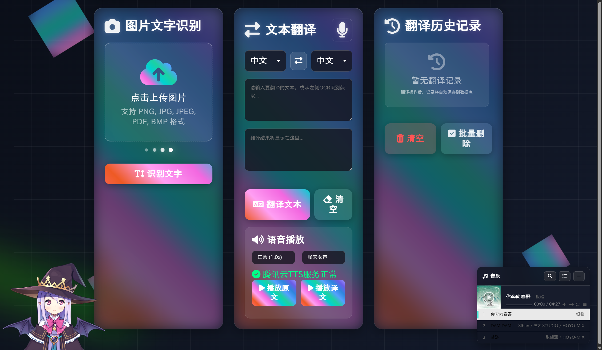

# 🤖 智能文本翻译助手（wenbenshibie）
[](https://www.python.org/downloads/)
[](https://flask.palletsprojects.com/)
[](LICENSE)


> ✨ 一个基于 **Flask + SQLite + 腾讯云 API** 的多功能翻译助手，集成 **文本翻译 / 图片 OCR 识别 / 语音合成（TTS）/ 语音转文本（ASR）**，并提供登录注册与翻译历史记录管理。

------


## 🌟 项目亮点

- 🧩 **一站式翻译工作台**：文字翻译、图片识别翻译、语音合成与语音识别整合到同一 Web 界面。
- 🔐 **登录/注册体系**：账号注册、登录、会话保持。
- 🗂️ **翻译历史记录**：自动记录用户操作，便于回溯与管理。
- 🪶 **SQLite 本地数据库**：无需安装 MySQL，开箱即用，适合课程设计/展示/打包发布。
- 📦 **可打包成 Windows 可执行程序**：使用 PyInstaller 将启动器 + Web 服务一起封装，双击即可启动。

------


## 🧰 技术栈

- 🐍 **后端**：Python 3.10+、Flask、Flask-SQLAlchemy
- 🗄️ **数据库**：SQLite（`translation_system.db`）
- 🎨 **前端**：HTML/CSS/JavaScript（模板：`templates/*.html`）
- ☁️ **第三方能力（腾讯云 SDK）**：
  - 🌍 机器翻译（TMT）
  - 🧾 通用高精度 OCR
  - 🔊 语音合成（TTS）
  - 🎙️ 一句话识别（ASR，60s 以内）
- 🎧 **音频处理**：pydub
- 🧳 **打包**：PyInstaller（spec：`wenbenshibie.spec`）

------


## 🗺️ 目录结构

text

```
wenbenshibie/
├─ app.py                      # Flask 主入口：路由/接口/模板渲染
├─ config.py                   # 全局配置（端口、数据库 URI 等）
├─ models.py                   # SQLAlchemy 模型：User、TranslationHistory
├─ database.py                 # SQLite 直连工具（调试/测试用）
├─ launcher_ui.py              # Windows 启动器（Tkinter）
├─ services/
│  ├─ translation_service.py   # 腾讯云机器翻译封装
│  ├─ ocr_service.py           # 腾讯云 OCR 封装
│  ├─ voice_service.py         # 腾讯云 TTS 语音合成封装
│  └─ speech_service.py        # 腾讯云 ASR 语音转文本封装
├─ templates/
│  ├─ login.html               # 登录页
│  ├─ register.html            # 注册页
│  └─ main.html                # 主界面（文本/图片/音频功能入口）
├─ static/
│  ├─ icon.ico                 # 项目图标
│  ├─ uploads/                 # 上传文件目录（图片/音频）
│  └─ audio/                   # TTS 生成的音频
├─ ffmpeg/
│  └─ bin/                     # ffmpeg.exe / ffprobe.exe（可不加环境变量）
├─ requirements.txt            # Python 依赖
└─ wenbenshibie.spec           # PyInstaller 打包配置
```


------

## 🛠️ 环境准备

### 🐍 Python 版本

推荐：**Python 3.10.x**。

### 📥 安装依赖

> Windows PowerShell：

powershell

```
cd "D:\c++ java  python code\wenbenshibie"
python -m pip install -r requirements.txt
```

------


## 🔑 腾讯云密钥配置

本项目的 OCR/翻译/TTS/ASR 均通过 **腾讯云 API** 调用，需要配置密钥。

### ✅ 推荐方式：环境变量

在系统环境变量或启动前设置：

- `TENCENTCLOUD_SECRET_ID`
- `TENCENTCLOUD_SECRET_KEY`

PowerShell 临时设置示例（只对当前窗口有效）：

powershell

```
$env:TENCENTCLOUD_SECRET_ID="你的SecretId"
$env:TENCENTCLOUD_SECRET_KEY="你的SecretKey"
```

### 🧪 打包后 EXE 如何注入密钥

打包后双击 exe 启动时仍然会读取环境变量。

你也可以在 **启动器** 中做“注入”（当前 `launcher_ui.py` 已支持读取环境变量并提供默认值，但更安全的做法是：不要把密钥写死在源码内）。

------


## ▶️ 本地运行（开发模式）

### 🚀 启动后端

powershell

```
cd "D:\c++ java  python code\wenbenshibie"
python app.py
```

默认端口来自 `config.py`：

- `HOST = 0.0.0.0`
- `PORT = 5001`

打开：

- `http://127.0.0.1:5001/`

### 🪟 启动 Windows 启动器（可选）

powershell

```
cd "D:\c++ java  python code\wenbenshibie"
python launcher_ui.py
```

启动器负责：

- 🧵 拉起 Web 服务
- 🌐 自动打开浏览器访问主页
- 🛑 一键退出并结束相关子进程

------


## 🗃️ 数据库（SQLite）

- 📄 数据库文件：`translation_system.db`
- 🔗 连接配置：`config.py -> SQLALCHEMY_DATABASE_URI`

首次启动 `create_app()` 时会自动：

- `db.init_app(app)`
- `db.create_all()`（自动建表）

### 🧾 表结构

- 👤 `users`：用户表（username、qq_email、password_hash、created_at）
- 🧠 `translation_history`：翻译历史表（关联 user_id，记录原文/译文/操作类型/图片路径等）

------


## 🧭 主要功能说明

### 🔐 注册/登录

- 注册页面：`/register`（`templates/register.html`）
- 登录页面：`/login`（`templates/login.html`，具体路由见 `app.py`）

注册校验点：

- 🧑 用户名：3~30 位，字母/数字/下划线
- 📧 QQ 邮箱：形如 `123456@qq.com`
- 🔒 密码：长度至少 6 位

### 🌍 文本翻译

- 输入原文
- 选择源语言/目标语言
- 调用腾讯云机器翻译获取结果

### 🖼️ 图片 OCR 识别 + 翻译

- 上传图片（png/jpg/jpeg/bmp/pdf）
- OCR 识别出文字
- 对识别结果再进行翻译（通常在页面内联动完成）

### 🔊 语音合成（TTS）

- 输入文本，选择语言/音色/语速
- 生成 mp3，保存到 `static/audio/`
- 前端直接播放生成的音频

### 🎙️ 语音转文本（ASR）

- 上传音频
- 服务端将音频统一转换为 `wav 16k 单声道`
- 调用腾讯云「一句话识别」返回文本

> 说明：该接口适用于 **60 秒以内** 短音频。

### 🧾 翻译历史记录

- 自动记录 OCR/翻译/TTS 等操作
- 支持查询、删除单条、清空等接口（具体实现以 `app.py` 路由为准）

------


## 🔌 接口汇总

- 📝 注册：`POST /api/register`
- ✅ 校验用户名：`GET /api/check/username/<username>`
- ✅ 校验邮箱：`GET /api/check/email/<email>`
- 🔊 语音合成：`POST /api/voice/synthesize`
- 🎙️ 语音转文本：`POST /api/speech-to-text`
- 🗂️ 翻译历史：`GET /api/translate/history`
- 🗑️ 删除单条历史：`DELETE /api/translate/history/<id>`
- 🧹 清空历史：`DELETE /api/translate/history/clear`

------


## 📦 打包成 Windows 单文件 EXE

当前项目已提供 spec：`wenbenshibie.spec`，入口为 `launcher_ui.py`（启动器）。

### 🧱 直接使用 spec 打包

powershell

```
cd "D:\c++ java  python code\wenbenshibie"
pyinstaller -y wenbenshibie.spec
```

- `-y`：自动确认覆盖 `dist/`、`build/` 等输出目录中的旧文件。

### 🧯 常见打包问题

#### 📄 缺少模板/静态资源

- 现象：运行时报 `FileNotFoundError: templates/...`
- 解决：确保 spec 的 `datas=[('templates','templates'),('static','static'), ...]` 不被改坏。

#### 🎧 ffmpeg 找不到

- 现象：ASR 上传音频后报错找不到 `ffmpeg/ffprobe`
- 解决：
  1. 保证 `ffmpeg/bin` 在项目里；
  2. spec 已把 `ffmpeg.exe/ffprobe.exe` 打包进去；
  3. 若自定义目录，可用环境变量 `FFMPEG_BIN/FFPROBE_BIN` 指定。

#### 🧊 退出时提示 Failed to remove temporary directory

- 说明：PyInstaller 单文件模式会把资源解压到 `%TEMP%\_MEIxxxxxx`，进程退出时尝试清理；
- 常见原因：仍有子进程/线程占用、某些文件句柄未完全释放；
- 影响：通常不影响功能，只是清理失败的提示；如要彻底解决，需要确保退出前关闭所有子进程并释放文件占用。

------


## 🖼️ 运行截图



------

## ⚖️ 许可证与声明

- 📚 本项目用于学习/课程设计/个人研究。
- 💰 调用腾讯云 API 产生的费用/配额由使用者自行承担。

------


## 🙏 致谢

- Flask / Werkzeug / SQLAlchemy 开源社区
- 腾讯云 API 与 Python SDK
- PyInstaller 打包工具


